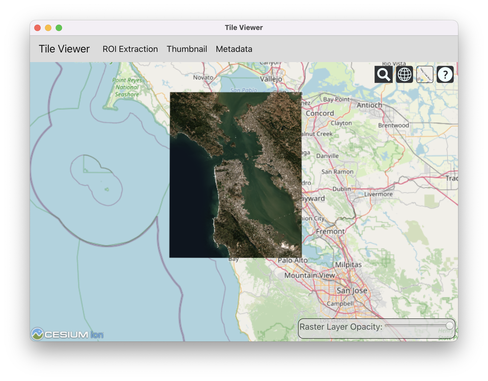

# ⚛️ Local Tile Server Electron App

This is an experimental Electron app for launching [`localtileserver`](https://github.com/banesullivan/localtileserver)
as a standalone application




## 🌟 Highlights

- Visualize local raster files in a standalone application
- Extract regions of interest


## ⬇️ Installation

```bash
pip install -r requirements.txt
npm start
```
